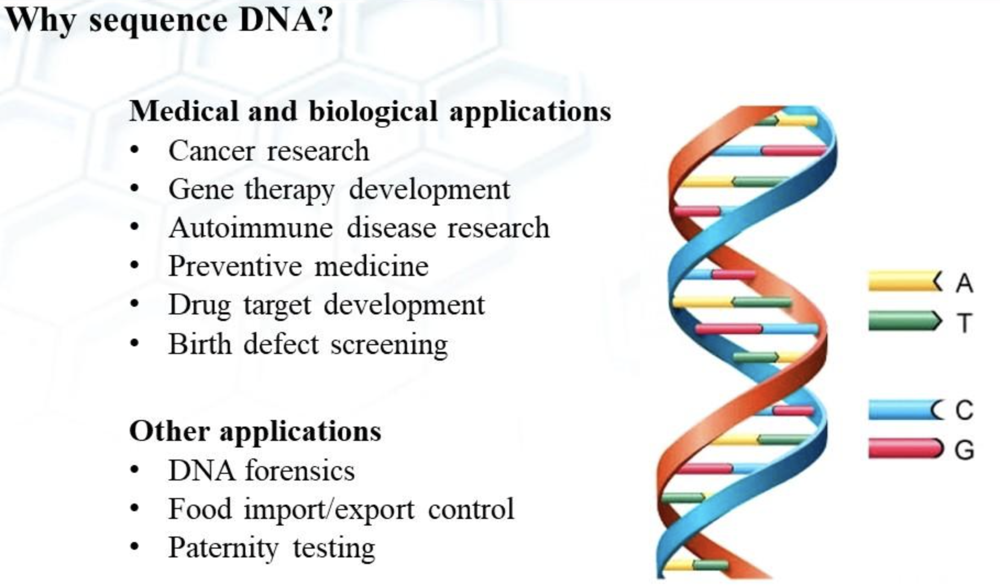

 # <b>  DNA Sequencing Using Machine Learning Algorithms
  
###  Investigator: Ehsan Gharib-Nezhad

  

  <a href="https://www.linkedin.com/in/ehsan-gharib-nezhad/" rel="nofollow noreferrer">
     LinkedIn
  </a> &nbsp; 
  <a href="https://github.com/EhsanGharibNezhad/" rel="nofollow noreferrer">
     Github
  </a>

  
# <a id = 'ProblemStatement'>Problem Statement</b></a>
High-throughput Next Generation Sequencing has played a crucial role in broadening our understanding of biology. Understanding the limitation and accuracy of the recorded data, however, is challening step as the interpretation of human genome relies on its accuracy. Traditional Machine learning-based tools as well as the deep learning neural network could provide an important means to rigriously vet the sequencing results and leverage the accuracy of the sequencing genomes and
transcriptomes. Critically speaking, machine learning provides powerful statistical tools to better understand the accuracy of the DNA sequencing. In this project, 4380 human DNA sequences and 7 family genes were employed to train and test a set of models using multiclass classification technique with traditional machien learning algorithiums including KNN, Randon Forest, SVM. Then, deep neural networks were generated with opimized architacture in order to boost the classification accuracy. The main objective of this project is to accuratly classify the human family genes given a set of DNA sequences.

---
  
# <a id = 'Content'> Content </b></a>

- [Problem Statement](#ProblemStatement)
- [Content](#Content)    
- [Repo Structure](#RepoStructure)    

    - [Data Dictionary](#ddict)
    - [Background](#Background)
    - [Statistical Models: Methodology and Concepts](#ModelingMethodology)    
    	- [1. Random Forest](#RandomForest)	
    	- [2. Neural Networks](#NeuralNetworks)	
    - [Results](#Results)    
<!--     - [Conclusion](#Conclusion)
    - [Recommendations](#Recommendations)
    - [References](#references) -->

---
# <a id = 'RepoStructure'> Repo Structure </b></a>
## notebooks/  

*Setp 1: Exploratory Data Analysis:*\
&nbsp; &nbsp; &nbsp; __ [1__Exploratory_Data_Analysis_EDA.ipynb](notebooks/1__Exploratory_Data_Analysis_EDA.ipynb) 

*Setp 2: DNA Sequence Dataset Processing:*\
&nbsp; &nbsp; &nbsp; __ [2__Generate_kmer_dataset.ipynb](notebooks/2__Generate_kmer_dataset.ipynb) 

*Setp 3: Traditional Machine Learning Models: Classifiers*\
&nbsp; &nbsp; &nbsp; __ [3__KNeighborsClassifier.ipynb](notebooks/3__KNeighborsClassifier.ipynb) 
&nbsp; &nbsp; &nbsp; __ [4__RandomForest.ipynb](notebooks/4__RandomForest.ipynb) 

*Setp 4: Feed-Forward Neural Networks: Classifiers*\
&nbsp; &nbsp; &nbsp; __ [5__FeedForward_Neural_Networks.ipynb](notebooks/5__FeedForward_Neural_Networks.ipynb) 
/>

## datasets/ 
*Unprocessed data collected from sub Reddits:*\
&nbsp; &nbsp; &nbsp; __ [human.txt](datasets/human.txt) 

---
---
# <a id = 'ddict'>Dataset <b>Dictionary</b></a>

|feature name|data type| possible values | represents| description | reference|
|---|---|---|---|---|---|
| Sequence |*object*| A, T, G, C | DNA sequence|    |   |
| Class|*integer*|0 |  G protein-coupled receptors (GPCRs)| G-protein-coupled receptors (GPCRs) are the largest and most diverse group of membrane receptors in eukaryotes. These cell surface receptors act like an inbox for messages in the form of light energy, peptides, lipids, sugars, and proteins| [[link]](https://www.nature.com/scitable/topicpage/gpcr-14047471/) |
|  |*integer*|1 |  Tyrosine kinase| a large multigene family with particular relevance to many human diseases, including cancer|[[link]](https://www.nature.com/articles/1203957) |
|  |*integer*|2 |  Protein tyrosine phosphatases| Protein tyrosine phosphatases are a group of enzymes that remove phosphate groups from phosphorylated tyrosine residues on proteins| [[link]](https://www.google.com/url?sa=t&rct=j&q=&esrc=s&source=web&cd=&cad=rja&uact=8&ved=2ahUKEwiI9omSsfP1AhVeJ0QIHbQbAF8QFnoECAcQAw&url=https%3A%2F%2Fen.wikipedia.org%2Fwiki%2FProtein_tyrosine_phosphatase&usg=AOvVaw26Gc_GqosG5hJnZu1uf4cy)|
|  |*integer*|3 |  Protein tyrosine phosphatases (PTPs)| to control signalling pathways that underlie a broad spectrum of fundamental physiological processes | [[link]](https://pubmed.ncbi.nlm.nih.gov/17057753/)|
|  |*integer*|4 |  Aminoacyl-tRNA synthetases (AARSs)| responsible for attaching amino acid residues to their cognate tRNA molecules, which is the first step in the protein synthesis | [[link]](https://www.ncbi.nlm.nih.gov/pmc/articles/PMC29805/)|
|  |*integer*|5 |  Ion channels| Ion channels are the pathways for the passive transport of various inorganic ions across a membrane| [[ref]](https://www.frontiersin.org/articles/10.3389/fgene.2019.00399/full) |
|  |*integer*|6 |  Transcription Factor| Transcription factors are proteins involved in the process of converting, or transcribing, DNA into RNA | [[link]](https://www.nature.com/scitable/definition/transcription-factor-167/)|

---
---
# <a id = 'Background'>Background</a> 
## 1. <a id = 'api'> DNA sequencing </a> 
DNA (Deoxyribonucleic acid) sequencing is the process of determining the nucleic acid sequence or the order of nucleotides in DNA molecule. In fact, it includes experimental techniques to determine the order of the four bases: Adenine (A), guanine (G), cytosine (C), and thymine (T). DNA sequencing is a crucial technique in biology because it is fundamental step in better understading the root of many genetic deseaise. The following figure illustrate the main concept of DNA sequecing as well as some of its importnat applications [[ref]](https://www.nist.gov/patents/nucleic-acid-sequencer-electrically-determining-sequence-nitrogenous-bases-single-stranded). 

  

  

---
# <a id = 'ModelingMethodology'>Statistical Models: Methodology and Concepts</b></a>

## <a id = 'RandomForest'>1. Random Forest</b></a>
A random forest is a supervised machine learning algorithm and is a part of ensemble methods. It is known for having lower overfitting issues than common decision trees because it creates a large ensemble of bootstrap trees and aggregates them. In this blog, I will discuss the fundamental backgrounds to better understand both Random Forest Classifiers and regressors.

In the bagging technique, all features get selected but the number of observations (or rows in the dataset) is different. Therefore, there is still some correlation between the bootstrap trees which results in high variance. Random Forest breaks this correlation by randomly selecting the features and not having all of them in all decision trees. Hence, Random Forest can be represented as a supervised machine learning algorithm that uses an enhanced version of the Bagging technique to create an ensemble of decision trees with low correlation.

`from sklearn.ensemble import RandomForestClassifier`

## <a id = 'NeuralNetworks'>2. Neural Networks</b></a>

Dendrites, axons, cell body might not be that familiar terms for everyone; however, the complexity of the neural networks in the brain could be a reasonable naive start to understanding the complexity of teaching a computer to solve problems. Here in this figure 4, the analogy between the signal transferring process and the deep neural network is depicted. 

*"The idea is that the synaptic strengths (the weights w) are learnable and control the strength of influence ... dendrites carry the signal to the cell body where they all get summed. If the final sum is above a certain threshold, the neuron can fire, sending a spike along its axon. In the computational model, we assume that the precise timings of the spikes do not matter and that only the frequency of the firing communicates information. Based on this rate code interpretation, we model the firing rate of the neuron with an activation function f."* - CS231-Stanford

# <a id = 'Results'>Results</b>

In the entire project, all posts are split into train and testing sets with the proportion of 75% and 25%, respectively. For each dataset, accuracy, precision, recall, F1 score as well as their false positive, false negative, and true positive and negative values are reported. The following equations are showing their definitions [[ref](https://developers.google.com/machine-learning/crash-course/classification/precision-and-recall)]:

  

  

  

  

     
<!-- # <a id = 'Conclusion'>Conclusion</b>

Random Forest is found to be the best statistical algorithm for classification because of the following reasons:
- Provides the highest accuracy scores, ~99% and ~96% for training and testing datasets 
- Works great with ultra-imbalanced samples (~93% vs. ~7%)
- High rates for true positive (91.06% out of 93%) and true negative (5.5% out of 7%)
- Low scores for false positive (1.57%) and false-negative (1.87%)
- High scores for precision and recall (~98%)


In addition, this model is…..
- Interpretable 
- Optimizable coefficients to reduce variance and bias
- Capable to use different generalization methods i.e., Lasso, Ridge, ElasticNet
- Tunable parameters, solvers, and penalty functions for multiple cases 
- Works best with both large and small datasets -->

